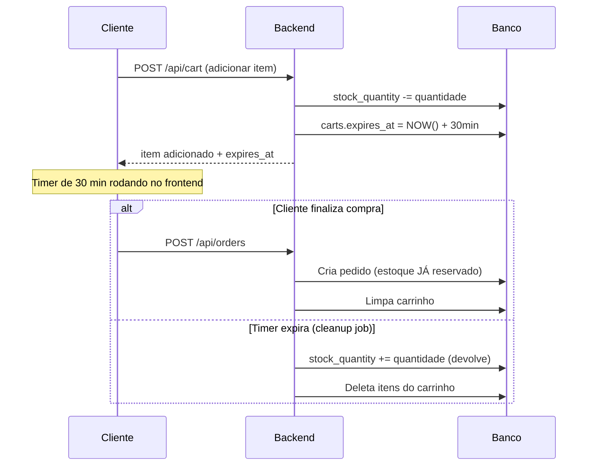

# Bloqueio Temporário de Estoque no Carrinho

## Contexto

Ao adicionar um item ao carrinho, o estoque deve ser **temporariamente reservado** (bloqueado) para evitar que outros clientes comprem o mesmo item. O bloqueio expira após um prazo parametrizável, e o timer reinicia a cada novo item adicionado. O usuário é notificado 5 min antes da expiração, e ao expirar, os itens são removidos e o estoque liberado.

## Proposta de Arquitetura

O timer de expiração será controlado a nível de **carrinho** (não por item individual), pois a regra diz "o prazo deve ser relativo ao último item incluído". Cada vez que um item é adicionado/atualizado, o `expires_at` do carrinho inteiro é recalculado.

> [!IMPORTANT]
> **Prazo parametrizável**: Será configurado via variável de ambiente `CART_TIMEOUT_MINUTES` (padrão: 30 minutos).

## Proposed Changes

### Backend - Banco de Dados

#### [MODIFY] [cartDao.js](file:///c:/Users/arthu/OneDrive/Fatec/SEMESTRE%206/LES/Lume/backend/models/dao/cartDao.js)
- Adicionar método `ensureCartColumns()` que faz `ALTER TABLE carts ADD COLUMN IF NOT EXISTS expires_at TIMESTAMP`
- Adicionar método `updateExpiration(cart_id, expires_at)` para atualizar o timer
- Adicionar método `getExpiredCarts()` para buscar carrinhos expirados
- Adicionar método `releaseCartStock(cart_id)` para devolver estoque dos itens expirados
- Modificar `getCartItems` para incluir `expires_at` do carrinho na resposta

---

### Backend - Lógica de Reserva de Estoque

#### [MODIFY] [cartController.js](file:///c:/Users/arthu/OneDrive/Fatec/SEMESTRE%206/LES/Lume/backend/controllers/cartController.js)
- **`createCart` (adicionar item)**: Ao adicionar item → `stock_quantity -= quantity` E `carts.expires_at = NOW() + TIMEOUT`
- **`updateCartItem`**: Ao atualizar quantidade → ajustar diferença no estoque e resetar `expires_at`
- **`deleteCartItem`**: Ao remover item → `stock_quantity += quantity` devolvida
- **`getCartItems`**: Incluir `expires_at` na resposta para o frontend usar o timer

#### [MODIFY] [booksDao.js](file:///c:/Users/arthu/OneDrive/Fatec/SEMESTRE%206/LES/Lume/backend/models/dao/booksDao.js)
- Adicionar método `reserveStock(book_id, quantity)` → `UPDATE books SET stock_quantity = stock_quantity - $1 WHERE id = $2`
- Adicionar método `releaseStock(book_id, quantity)` → `UPDATE books SET stock_quantity = stock_quantity + $1 WHERE id = $2`

---

### Backend - Job de Limpeza

#### [NEW] [cartCleanup.js](file:///c:/Users/arthu/OneDrive/Fatec/SEMESTRE%206/LES/Lume/backend/middlewares/cartCleanup.js)
- `setInterval` que roda a cada **1 minuto**
- Busca carrinhos com `expires_at < NOW()` e `status = 'aberto'`
- Para cada carrinho expirado: devolve estoque de cada item, deleta os itens, atualiza status do carrinho

#### [MODIFY] [server.js](file:///c:/Users/arthu/OneDrive/Fatec/SEMESTRE%206/LES/Lume/backend/server.js)
- Importar e iniciar o job de limpeza

---

### Backend - Ajuste na Finalização do Pedido

#### [MODIFY] [orderController.js](file:///c:/Users/arthu/OneDrive/Fatec/SEMESTRE%206/LES/Lume/backend/controllers/orderController.js)
- Na `createOrder`: **NÃO** devolver estoque ao finalizar (já foi decrementado no carrinho)
- Apenas limpar o carrinho sem devolver estoque

---

### Frontend - Timer e Notificação

#### [MODIFY] [cart.html](file:///c:/Users/arthu/OneDrive/Fatec/SEMESTRE%206/LES/Lume/frontend/pages/client/cart.html)
- Adicionar elemento de countdown timer no topo do carrinho
- Usar `expires_at` da API para calcular tempo restante
- Mostrar notificação (alert ou banner) quando faltar 5 minutos
- Quando expirar: mostrar mensagem e recarregar a página

---

## Fluxo Resumido

## Verification Plan

### Manual Verification
1. Adicionar item ao carrinho → verificar que `stock_quantity` diminuiu
2. Remover item do carrinho → verificar que `stock_quantity` voltou
3. Esperar expiração → verificar que itens foram removidos e estoque restaurado
4. Finalizar compra → verificar que estoque NÃO volta (já estava reservado)
5. Verificar timer no frontend e notificação de 5 min
